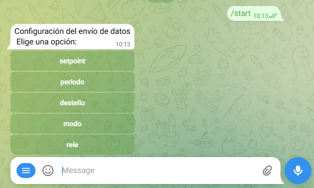
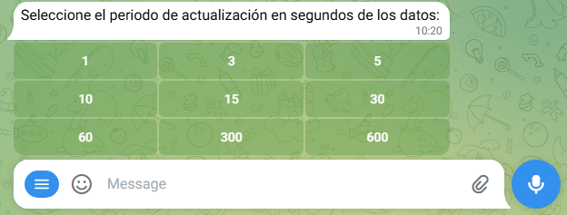

# Configuración remota mediante Telegram Bot

De acuerdo a los ingresos del usuario, publíca vía mqtts las órdenes para el termostato: setpoint, periodo, destello, modo y relé.

## Descripción del funcionamiento
En el bot se definen dos comandos acercade, el cual muestra información sobre el bot y start que permite la interacción con el mismo para publicar las ordenes.
Al iniciar con el comando start aparece un teclado en línea, el cual muestra las opciones setpoint, periodo, destello, modo y relé.

### Setpoint
La opción setpoint setea una bandera para el handler y muestra un mensaje solicitando el ingreso de un número entero por parte del usuario. Como se usa MessageHandler, el mismo se dispara cada vez que el usuario realiza un igreso por teclado, pero este solo actúa cuando la bandera se encuentra en alto.
### Periodo
Al seleccionar la opción periodo, se muestra otro teclado en línea con las diferentes opciones para setear el periodo. Al seleccionar el una de ellas, se publica la misma en el topico perido.

### Destello
Publica la orden (1) en el topico destello.
### Modo y Relé
Al seleccionar estas opciones, en ambos casos, aparece un teclado en línea con dos opciones; en el caso de modo las opciones son auto y manual, mientras que en el caso de relé son on y off. Estos comandos se manejan con las mismas funciones, es decir, al elegir auto o on en cada caso, se llama a la función set que publica un 1 (uno) en el topico correspondiente, el cual es guardado en la variable topico de la información de contexto del usuario cuando se selecciona la opción. De la misma manera, las funciones manual y off se manejan con la función reset, la cual publica un 0 (cero) en el topico correspondiente.
